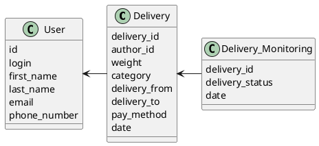

# Компонентная архитектура
<!-- Состав и взаимосвязи компонентов системы между собой и внешними системами с указанием протоколов, ключевые технологии, используемые для реализации компонентов.
Диаграмма контейнеров C4 и текстовое описание.
-->
## Компонентная диаграмма

```plantuml
@startuml
!include https://raw.githubusercontent.com/plantuml-stdlib/C4-PlantUML/master/C4_Container.puml

AddElementTag("microService", $shape=EightSidedShape(), $bgColor="CornflowerBlue", $fontColor="white", $legendText="microservice")
AddElementTag("storage", $shape=RoundedBoxShape(), $bgColor="lightSkyBlue", $fontColor="white")

Person(admin, "Администратор")
Person(moderator, "Модератор")
Person(user, "Пользователь")

System_Ext(web_site, "Клиентский веб-сайт", "HTML, CSS, JavaScript, React", "Веб-интерфейс")

System_Boundary(conference_site, "Сайт сервиса доставки") {
   'Container(web_site, "Веб-сайт сервиса доставки", ")
   Container(client_service, "Сервис авторизации", "C++", "Сервис управления пользователями", $tags = "microService")
   Container(post_service, "Сервис оформления доставки", "C++", "Сервис управления доставки", $tags = "microService")
   Container(blog_service, "Сервис отслеживания доставки", "C++", "Сервис мониторнга доставок", $tags = "microService")
   ContainerDb(db, "База данных", "MySQL", "Хранение данных о доставках, местопложению и пользователях", $tags = "storage")

}

Rel(admin, web_site, "Просмотр, добавление и редактирование информации о возможных способах доставки, администрирование")
Rel(moderator, web_site, "Модерация контента")
Rel(user, web_site, "Регистрация, добавление/просмотр/изменение информации о доставке")

Rel(web_site, client_service, "Работа с пользователями", "localhost/person")
Rel(client_service, db, "INSERT/SELECT/UPDATE/DELETE", "SQL")

Rel(web_site, post_service, "Работа с доставками", "localhost/pres")
Rel(post_service, db, "INSERT/SELECT/UPDATE/DELETE", "SQL")

Rel(web_site, blog_service, "Работа с мониторингом доставок", "localhost/conf")
Rel(blog_service, db, "INSERT/SELECT/UPDATE", "SQL")

@enduml
```
## Список компонентов

### Сервис авторизации
**API**:
-	Создание нового пользователя
      - входные параметры: login, пароль, имя, фамилия, email, phone_number
      - выходные параметры: отсутствуют

### Сервис оформления доставки
**API**:
- Создание доставки
  - Входные параметры: выбор веса, категория перевозки, точка отправки, точка получения, сроки доставки, способ оплаты
  - Выходные параметры: идентификатор доставки
- Редактирование информации
  - Входные параметры: конкретная доставка
  - Выходные параметры: измененный состав характеристик доставки

### Сервис отслеживания доставки
**API**:
- Получение списка всех посылок
  - Входные параметры: отсутствуют
  - Выходные параметры: массив из посылок, где для каждого указаны его идентификатор, статус доставки и сроки доставки


### Модель данных

